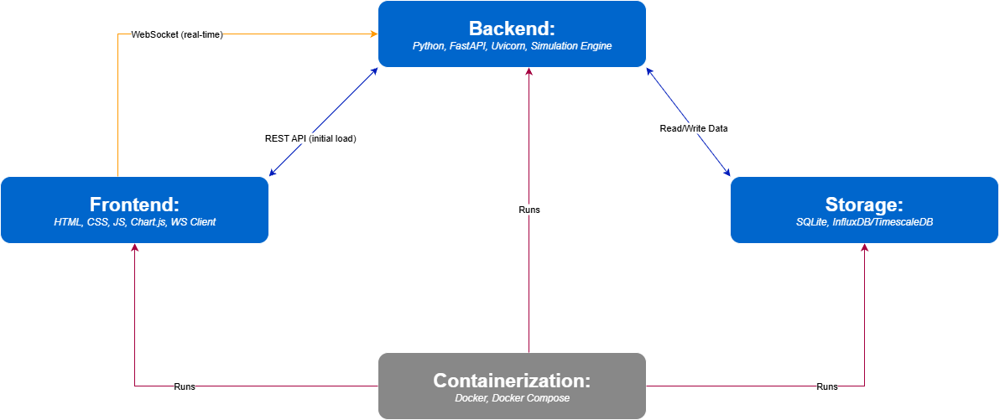
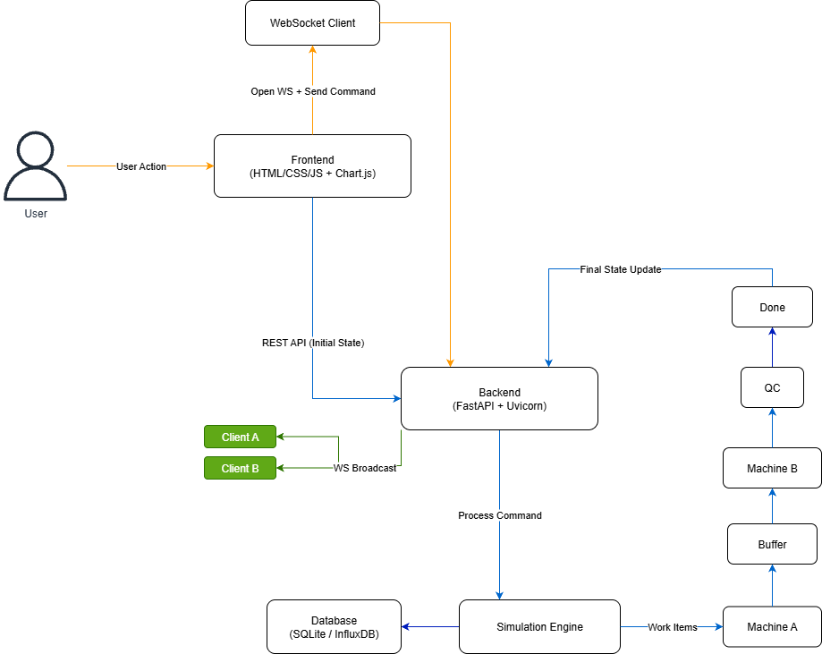

# Factory_Floor_Digital_Twin

Here is an overview of the setup process for the Factory Floor Digital Twin project:

## Prerequisites

- **Python 3.7+**: [Download Python](https://www.python.org/downloads/)
- **pip**: Usually included with Python installations.

## Installation (Local Development)

1. **Install project dependencies**:
    ```bash
    pip install "fastapi[all]"
    pip install paho-mqtt python-multipart
    ```
2. **Run the application**:
    ```bash
    uvicorn backend:app --host 0.0.0.0 --port 8000
    ```
   The server will be available at [http://localhost:8000](http://localhost:8000).

## Dockerized Setup

### Run with Docker Compose (Recommended)

1. **Build and start the containers**:
    ```bash
    docker-compose up --build
    ```
2. **Access**: Open [http://localhost:8000](http://localhost:8000) in your browser.
3. **Stop containers**:
    ```bash
    docker-compose down
    ```

### Run with Docker Only

1. **Build the Docker image**:
    ```bash
    docker build -t factory-floor-digital-twin .
    ```
2. **Run the container**:
    ```bash
    docker run -d -p 8000:8000 factory-floor-digital-twin
    ```
3. **Access**: Open [http://localhost:8000](http://localhost:8000).

## Demo Credentials

- **Admin**: username: `admin`, password: `admin123`
- You can register new users (Admin or Viewer roles) via the web UI.


## Documentation diagrams:
### 1. Architecture Diagram


### 2. Process Flow Diagram


